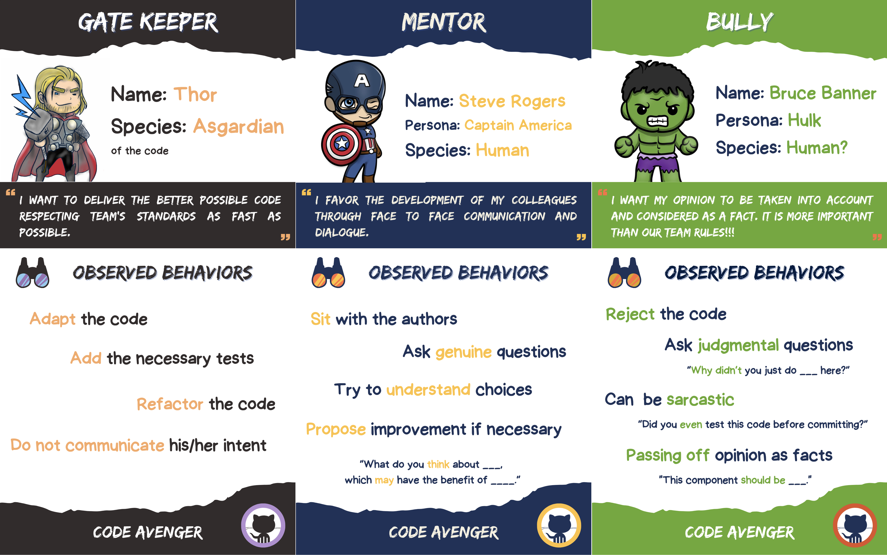

## Concrete Practice - Code Avengers
### Iteration 1
- Create groups of 3
### Iteration 1
#### Preparation
Each attendee takes :
- A role card and **keep it secret**
- A [checklist](files/checklist.pdf)
- A code snippet:
  - 1 different per attendee
  - [TimelineEvents.scala](https://github.com/hmrc/customs-declare-exports-frontend/blob/57e007083fb833079df239a2747b633186b599ff/app/views/helpers/TimelineEvents.scala)
  - [ssh.scala](https://github.com/seL4/isabelle/blob/38e7963558cc4c73e9bd4886e97e8a9f027be416/src/Pure/General/ssh.scala)
  - [preview-images.ts](https://github.com/Irithys/moive/blob/e8ea89ff701eaf3a7ea844f9448c59ecb222594d/lib/preview-images.ts)
  - [message_stream.ts](https://github.com/snislam/faucets-server/blob/14fa7b42401ea7c19798ecc11d91bd659cf8f2a9/node_modules/mongodb/src/cmap/message_stream.ts)
  - [424-longest-repeating-character-replacement.kt](https://github.com/raymondwzeng/2021-2022-Leetcode/blob/28754156e224b7ed2c71b15cc86cf1f182ace899/424-longest-repeating-character-replacement/424-longest-repeating-character-replacement.kt)
  - [BestEffortTimeStatistic.kt](https://github.com/nbulteau/mystravastats/blob/a5628b86ac3006f17e68e72ee7d8d2f77dafd610/src/main/kotlin/me/nicolas/stravastats/service/statistics/BestEffortTimeStatistic.kt)
  - [EdibleProductsRetailerController.java](https://github.com/shivtu/kucchil-kitchen/blob/774245ae8eccb1e81f66960db6130fa5ebbc843d/src/main/java/com/example/retail/controllers/retailer/edibleproducts_retailer/EdibleProductsRetailerController.java)
  - [PhpFileWriter.java](https://github.com/meghrajdadhich/PhpCodeWriter_microservice/blob/51b9c0e282d96857cefaea1e7cc67bbea3a38e51/src/PhpFileWriter.java)
  - [Dao.java](https://github.com/yxl1014/JAVA-Curriculum-design/blob/ad367125e6c50835a657fdacec65981d5f01b754/src/demo/mysql/Dao.java)
  - [CallExpression.php](https://github.com/IagoB7ima/glpicss/blob/54ce418c1580432edf5bfcf5b25f87eb752b4689/glpi/vendor/twig/twig/src/Node/Expression/CallExpression.php)
  - [EscaperExtension.php](https://github.com/IagoB7ima/glpicss/blob/54ce418c1580432edf5bfcf5b25f87eb752b4689/glpi/vendor/twig/twig/src/Extension/EscaperExtension.php)

#### Solo review (10')
Prepare a code review as a code avenger: role-play based on your role card.

#### Review time (5') :
- Each member explains his/her discovery in the code to the two others.
- The 2 others take notes to record `key moments`

You can record conversations by recording it like this:

| What I thought / Felt                     | What ____________ said                               |
|-------------------------------------------|------------------------------------------------------|
| "record everything you have in mind here" | "record everything that seems important to you here" |

- Record which questions have been asked
  - Identify `genuine` questions
  - Evaluate `curiosity: genuine questions / total number of questions`

#### Group debriefing (10')
- Share about your notes
- Try to spot who is which avenger

  

  Role play cards (do not reveal)
  

- [PDF printable version](files/code-avengers.pdf)
- [PNG cards](files/code-avengers.zip)

[Source: Commitstrip](https://www.commitstrip.com/en/2015/02/10/the-truth-about-code-reviews/?setLocale=1?setLocale=1)

### Iteration 2 - Give feedback