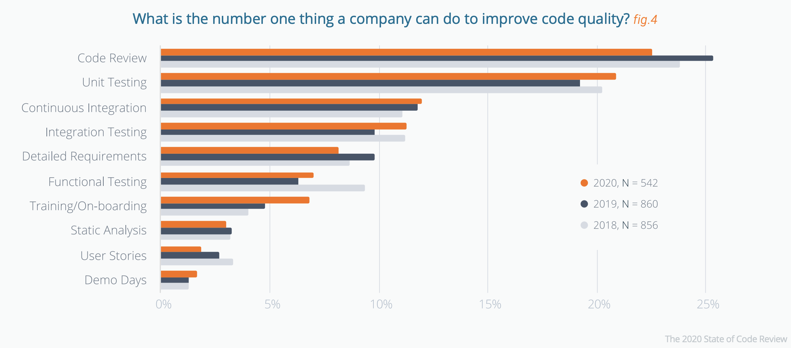
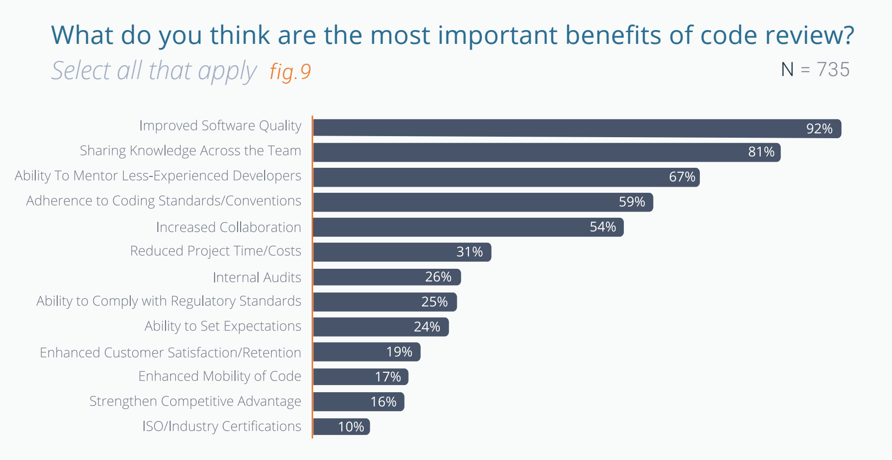
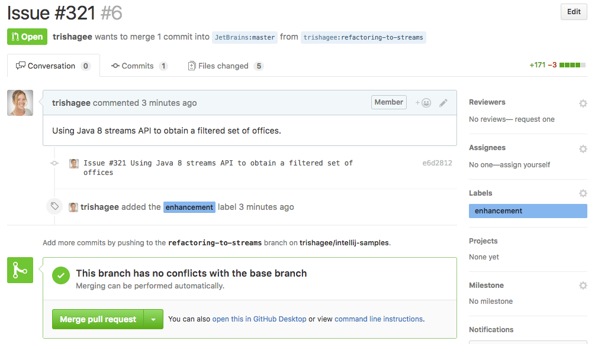
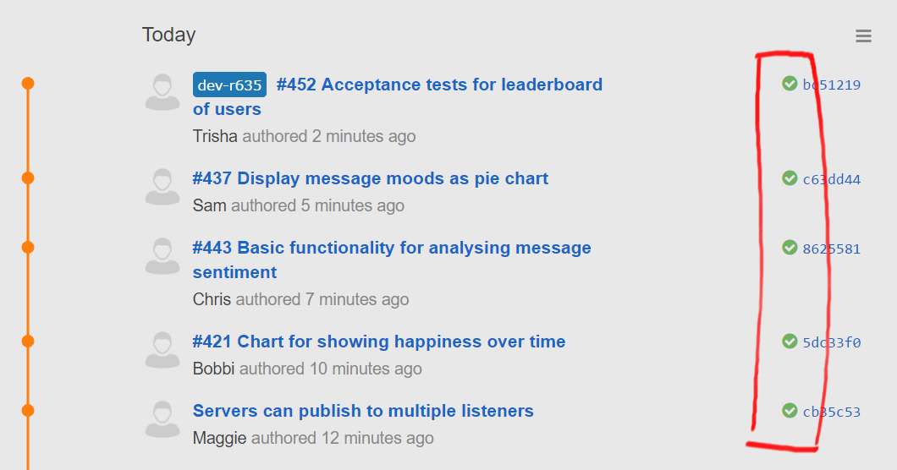
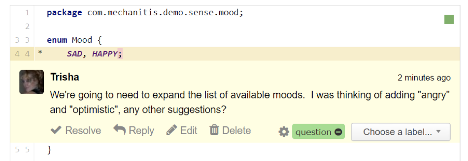
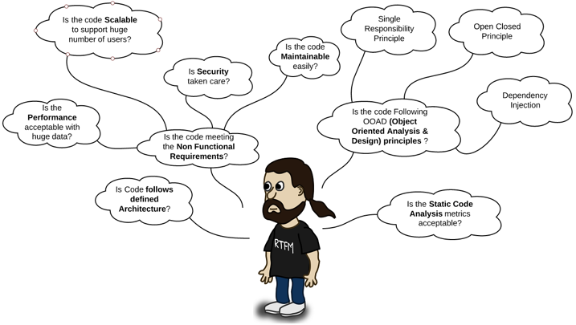
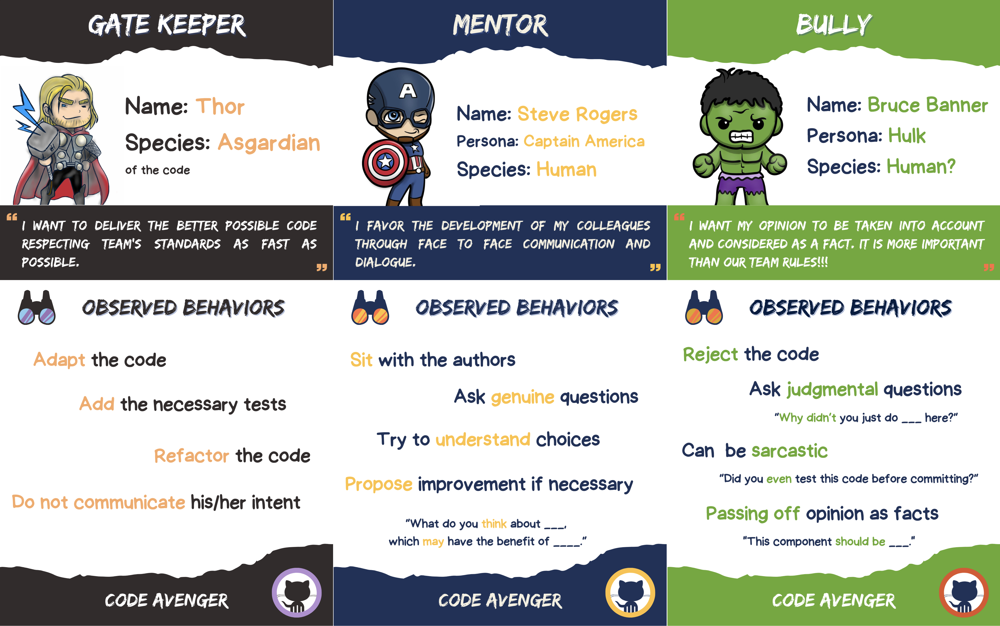
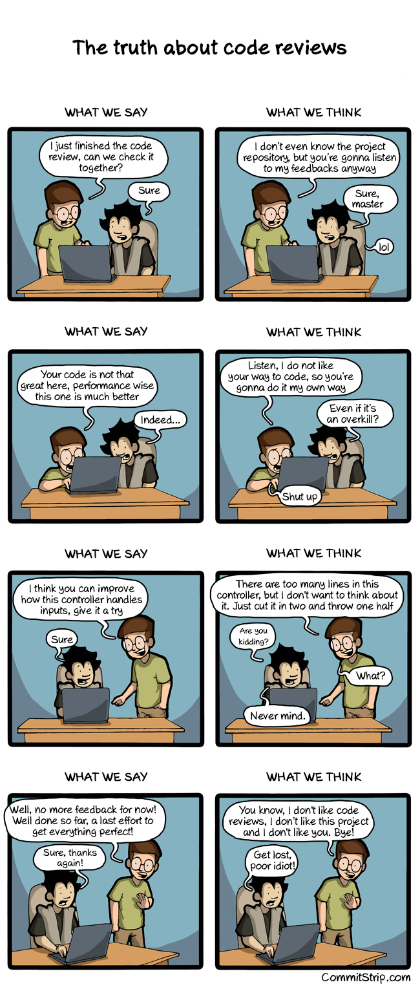
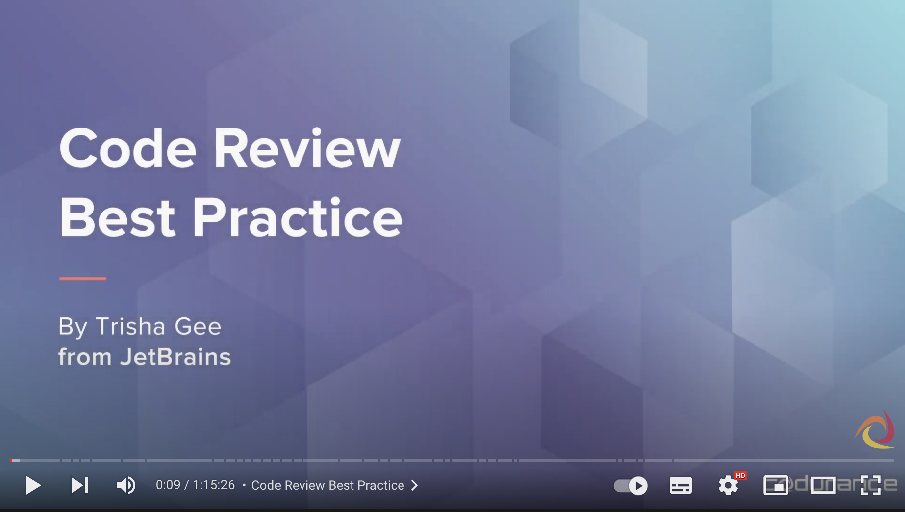

# Code Review
## Connection - Goals (10')
- In solo, describe what are your objectives when you review peer’s code?
  - How do you do it?
  - What do you look for?
- What makes a successful code review?
- Share in pair then in groups of 4

## Concepts - What is `Code Review` (20')
> Code reviews are methodical assessments of code designed to identify bugs, increase code quality, and help developers learn the source code.

It is an improvement quality tool that comes at cost.

[Source: State of Code Review by Smartbear](https://static1.smartbear.co/smartbearbrand/media/pdf/the-2020-state-of-code-review.pdf)

### How to do it?
- Don't review anything that you can automate
  - Spell check
  - Code beautifier
- Small batches
  - `No more than 200 to 400 lines of code` (LOC) at a time
  - Brain cannot process and detect errors if too much data
- Mindset
> Do you want my blessing or my feedback ?

### Who ?
- Everyone's code can be reviewed
  - Any Dev can review
  - The code of the most senior may also be reviewed
- Reviewer's
    - Attitude
      - Humble
      - Give feedback
      - Don’t blame
    - Need to get knowledge of the functional analysis
    - Checkout the code on his/her workstation and run it

[Source: The Code Review Pyramid by Gunnar Morling](https://www.morling.dev/blog/the-code-review-pyramid/)

### When ?
- Could be `on-demand`
- Or, if the CI `quality gate not passed`
- And anyway, before a story can be considered ***Done***

### Why ?

[Source: State of Code Review by Smartbear](https://static1.smartbear.co/smartbearbrand/media/pdf/the-2020-state-of-code-review.pdf)

- Better code
  - Ensure code meets standards
  - Find bugs
  - Ensure code does what it’s supposed to
  - Check code is understandable/maintainable
- Share Knowledge
  - Spread `code Ownership`
  - No better way to learn the right practices and promote the company’s code guidelines and requirements
- Collaborate on Design
- Improve communication inside the team
  - Every team members talk to each others
  - Foster companionship and improve team cohesion
- Motivate to progress
  - If you keep in mind that your code will be reviewed by some colleagues, you will put more care into it
  - You will take the time to properly :
    - Name identifiers
    - Write tests
    - Introduce well-fitted abstractions
    - Use carefully the enterprise wide patterns

### Different Workflows
#### [Gateway review](https://blog.jetbrains.com/upsource/2017/01/18/code-review-as-a-gateway/)

A developer :
- Picks up or is assigned a task
- Implements the code to the best of his/her ability
- `Submits it for review`

The reviewer checks the code and, if everything is OK : the code is merged into the main development branch.

#### [Knowledge Sharing](https://blog.jetbrains.com/upsource/2017/03/14/code-review-for-knowledge-sharing/)
- Learning at the center of the process
- The purpose is not to check if the code is correct
- But to `share with other developers what changes have been made`

#### Early Design Feedback

* A collaborative and iterative approach to:
  * `Check the code frequently while it’s being built`
  * So design feedback comes at the right time

### Anti-Patterns (List from Trisha Gee)
- My job as a Reviewer is to `find problems`
  - When you try to find problems, you will always find more problems
  - Always remember that you bring you own preferences/biases
- `Nit picking`
  - Spacing is wrong/Formatting
  - Automate this kind of check
  - Waste of time for a human
- `Change the design` when the code works as expected
  - "You find it too late"
  - Design must be discussed early on
- `Inconsistent feedback`
  - Example: feedback biased because I have followed a security training
  - Next week it will be on compliance for example…
  - To avoid this :
    - Have `clear guidelines`
    - `Use checklists`
- The `Ghost Reviewer`
  - No time for it 
> The bigger the code review, the more likely it will receive a green check

- `Ping Pong` (Between reviewer and author)
  - Happens when your goal is to find problems
  - Have a `Definition of Done`
  - Clear guidelines

### Use a checklist

#### Example
- [ ] **Compliance**
  - [ ] With internal tech radar (Lombok, MapStruct, ..)
  - [ ] Right version of the libraries (Java 17)
  - [ ] Pass internal automatic quality gates
- [ ] **Operability**
  - [ ] Logging give context for debugging
  - [ ] Configuration separated from the code
- [ ] Is the code **readable**
  - [ ] Names covey **intent**
  - [ ] APIs are documented
- [ ] Is the code **SOLID** ?
  - [ ] Team **conventions** followed
  - [ ] There is **no obsolete code**/function
  - [ ] There is **no commented out code** or TODOs
  - [ ] Use of design patterns when appropriate (modularity, simplicity,...)
- [ ] Do the tests
  - [ ] Cover requirements
  - [ ] Cover confusing / complicated and limits of the code
  - [ ] Checks the performance
- ...

Be aware that async code reviews can have an impact on team's Lead Time: [Async Code Reviews Are Killing Your Company’s Throughput](https://www.slideshare.net/kobac/async-code-reviews-are-killing-your-companys-throughput-248758692)

### Capture metrics

- `Inspection rate`
  - Speed with which a review is performed.
- `Defect rate`
  - Number of bugs found per hour of review.
- `Defect density`
  - Average number of bugs found per line of code.

## Concrete Practice - Code Avengers 30'
- Create groups of 3
### Iteration 1
#### Preparation
Each attendee takes :
- A role card and **keep it secret**
- A checklist
- A code snippet

#### Solo review (10')
Prepare a code review as a code avenger: role-play based on your role card.

#### Review time (5') :
- Each member explains his/her discovery in the code to the two others.
- The 2 others take notes to record `key moments`

You can record conversations by recording it like this:

| What I thought / Felt                     | What ____________ said                               |
|-------------------------------------------|------------------------------------------------------|
| "record everything you have in mind here" | "record everything that seems important to you here" |

- Record which questions have been asked
  - Identify `genuine` questions
  - Evaluate `curiosity: genuine questions / total number of questions`

#### Group debriefing (10')
- Share about your notes
- Try to spot who is which avenger

  

  Role play cards (do not reveal)
  

- [PDF printable version](files/code-avengers.pdf)
- [PNG cards](files/code-avengers.zip)

### Iteration 2 - Give feedback

## Conclusion - Pair Programming and Code Reviews
> Don't let reviews be an ego match.

- What could you do in the next 10 days that could help you make better code reviews in your team?
- Pair Programming and Code Review how could it fit in your team / development process?

> Being the most senior person on the team does not imply that your code does not need review...

### Resources
- [Code Review Best Practices by Trisha Gee](https://blog.jetbrains.com/upsource/2018/08/30/code-review-best-practices/)
- [The Code Review Pyramid](https://www.morling.dev/blog/the-code-review-pyramid/)
- [Code Review Workflows](https://blog.jetbrains.com/upsource/tag/code-review-workflows/)
- [Code Review Guidelines by Patrick Smacchia](https://blog.ndepend.com/what-is-code-review-guidelines-best-practices/)
- [Ebook "What to look for in a code review"](http://jb.gg/book/codereview)
- [Agile conversations](https://hennyportman.files.wordpress.com/2020/09/qrc-agile-conversations.pdf)
- [Management 3.0 - Better feedback](https://management30.com/develop-competence/better-feedback/)

