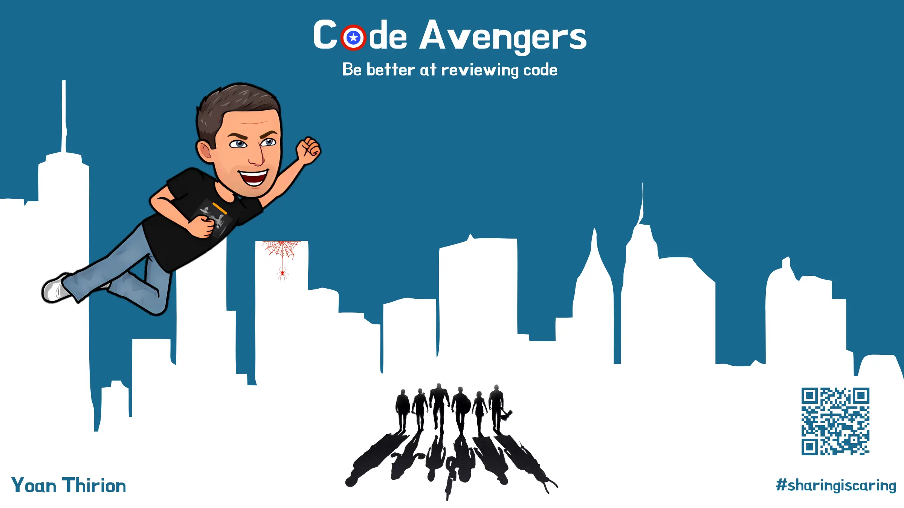

# Code Avengers - Be Better At Reviewing Code

- [Connection - Goals](1.connection.md)
- [Concepts - What is `Code Review`](2.concepts.md)
- [Concrete Practice - Code Avengers](3.concrete-practice.md)
- [Conclusion - Pair Programming and Code Reviews](4.conclusion.md)

### Resources
- [Ship / Show / Ask](https://martinfowler.com/articles/ship-show-ask.html)
- [Code Review Best Practices by Trisha Gee](https://blog.jetbrains.com/upsource/2018/08/30/code-review-best-practices/)
- [The Code Review Pyramid](https://www.morling.dev/blog/the-code-review-pyramid/)
- [Code Review Workflows](https://blog.jetbrains.com/upsource/tag/code-review-workflows/)
- [Code Review Guidelines by Patrick Smacchia](https://blog.ndepend.com/what-is-code-review-guidelines-best-practices/)
- [Ebook "What to look for in a code review"](http://jb.gg/book/codereview)
- [Agile conversations](https://hennyportman.files.wordpress.com/2020/09/qrc-agile-conversations.pdf)
- [Management 3.0 - Better feedback](https://management30.com/develop-competence/better-feedback/)

